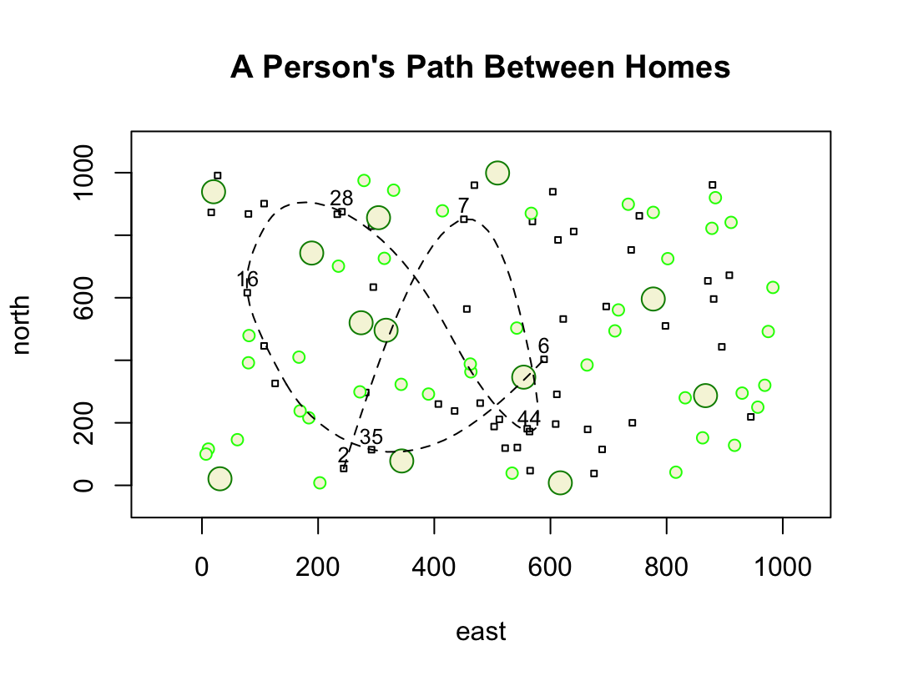
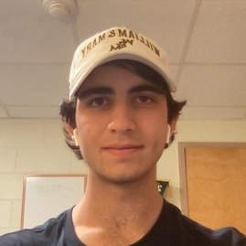

# Projects

## Introduction

My name is Jake Podgurski and I'm from Columbus, Ohio. I am a freshman student at William & Mary and I plan to double major in Computer Science and Data Science because I have been very interested in computer science since 8th grade, and more recently I have been very interested by statistics and its applications in computing. Some of my other hobbies/interests include but are not limited to: hiking, biking, baseball, bowling, card games, and video games. I am very excited for this course!

### Here's a picture of me

